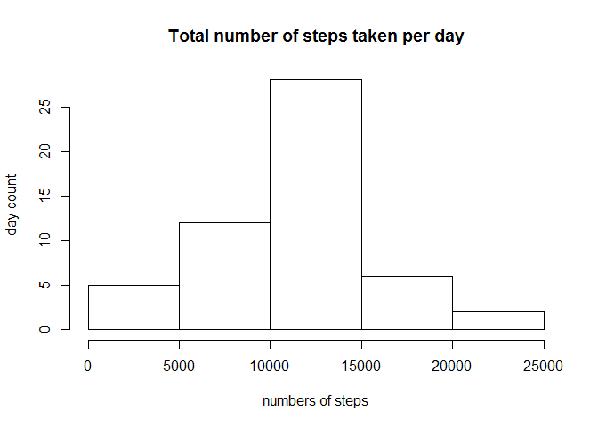

# Reproducible Research: Peer Assessment 1

```r
require(knitr)
require(dplyr)
require(ggplot2)
Sys.setlocale("LC_TIME", "English")
opts_chunk$set(echo = TRUE)
```


## Loading and preprocessing the data

```r
unzip("activity.zip")
activity <- read.csv("activity.csv")
activity$date <- as.Date(activity$date)
```


## What is mean total number of steps taken per day?


```r
# Make a histogram of the total number of steps taken each day

total_steps <- with(activity, tapply(steps, date, sum))
hist(total_steps, xlab = "numbers of steps", ylab = "day count",
     main = "Total number of steps taken per day")
```

<!-- -->


```r
# Calculate the mean and median total number of steps taken per day

mean(total_steps, na.rm = TRUE)
```

```
## [1] 10766.19
```

```r
median(total_steps, na.rm = TRUE)
```

```
## [1] 10765
```


## What is the average daily activity pattern?

```r
average_steps <- aggregate(steps ~ interval, activity, mean,
                           na.action = na.omit)
plot(steps ~ interval, data = average_steps, type = "l",
     main = "Average number of steps taken per interval")
```

<!-- -->

```r
max_minute <- average_steps$interval[which.max(average_steps$steps)]
```
### The interval contains maximum number of steps: **835**


## Imputing missing values

```r
# Calculate and report the total number of missing values
na_steps <- is.na(activity$steps)
na_count <- sum(na_steps)
```
### There are total **2304** missing values.  

### Fill them by the mean for that 5-minute interval.

```r
na_min <- match(activity$interval[na_steps], average_steps$interval)
activity$steps[na_steps] <- average_steps$steps[na_min]
```

### Re-calculate the total number of steps taken per day.


```r
total_steps_new <- with(activity, tapply(steps, date, sum, na.rm = TRUE))
hist(total_steps_new, xlab = "numbers of steps", ylab = "day count",
     main = "Updated total number of steps taken per day")
```

<!-- -->

```r
mean(total_steps_new)
```

```
## [1] 10766.19
```

```r
median(total_steps_new)
```

```
## [1] 10766.19
```

### Do these values differ from the estimates from the original data set?

```r
identical(mean(total_steps, na.rm = TRUE), mean(total_steps_new))
```

```
## [1] TRUE
```

```r
identical(median(total_steps, na.rm = TRUE), median(total_steps_new))
```

```
## [1] FALSE
```
### Mean of the new dataset is **the same**, but median is **different**.

### What is the impact of imputing missing data on the estimates of the total daily number of steps?

```r
sum(total_steps_new) - sum(total_steps, na.rm = TRUE)
```

```
## [1] 86129.51
```

## Are there differences in activity patterns between weekdays and weekends?


```r
weekday <- weekdays(activity$date, abbreviate = FALSE)
activity <- mutate(activity, day = factor(weekday %in% c("Sunday", "Saturday"),
                                          labels = c("weekend", "weekday")))

activity_per_day <- aggregate(steps ~ interval + day,
                              activity, mean, na.action = na.omit)
ggplot(data=activity_per_day, aes(x=interval, y=steps, color = day),
       main="Average number of steps taken") + 
        facet_wrap(~day, nrow = 2, ncol = 1) + geom_line()
```

<!-- -->
